# Workout Planner 


**Developer: Aleksandra Haniok**

💻 [Visit live website](https://ci-pp4-workout-planner.herokuapp.com/)


## Table of Contents
  - [About](#about)
  - [User Goals](#user-goals)
  - [Site Owner Goals](#site-owner-goals)
  - [User Experience](#user-experience)
  - [User Stories](#user-stories)
  - [Design](#design)
    - [Colours](#colours)
    - [Fonts](#fonts)
    - [Structure](#structure)
      - [Website pages](#website-pages)
      - [Database](#database)
    - [Wireframes](#wireframes)
  - [Technologies Used](#technologies-used)
  - [Features](#features)
  - [Validation](#validation)
  - [Testing](#testing)
    - [Manual testing of user stories](#manual-testing-of-user-stories)
    - [Automated testing](#automated-testing)
    - [Performing tests on various devices](#performing-tests-on-various-devices)
    - [Browser compatibility](#browser-compatibility)
  - [Bugs](#bugs)
  - [Configuration](#configuration)
    - [Google emails](#google-emails)
    - [Heroku Deployment](#heroku-deployment)
  - [Credits](#credits)
  - [Acknowledgements](#acknowledgements)

### About

The Workout Planner is an application for creating weekly training rota which also gives users ideas of exercises for their next training session.

### User Goals

- Be able to plan their workouts
- Be able to amend their plan at any point
- View the plan at any time

### Site Owner Goals

- Provide an online solution for users to plan their weekly workouts
- Create visually appealing design
- Provide fully responsive application with straightforward navigation


## User Experience

### Target Audience
- People who want to be more organised with their workouts
- Gym enthusiasts who focus on training different body parts and want to plan their weekly schedule to potentially avoid repetitions in their training
- People who want to keep track of their workout/fitness routine
- People who don’t want to think back and remember which day of the week they trained a specific part of the body

### User Requirements and Expectations

- Straightforward navigation
- Easy to use
- A responsive application that allows the user to access their plan on any device
- Visually appealing design for all screen size
- Links and functions that work as expected
- An easy way to contact the developer
- Accessibility

##### Back to [top](#table-of-contents)


## User Stories

### Users

1.	I want to see the home page with explanation of the app
2.	I want to be able to easily navigate around the application to different pages
3.	I want to create my account to be able to plan my workouts
4.	I want to prepare a plan for multiple weeks in advance
5.	I want to be able to edit my current plans at any point
6.	I want to delete my plan if no longer needed
7.	I want to see feedback messages so that I know that my plan was created, edited or deleted
8.	I want to be able to view previous plans to help me prepare the following week’s workout
9.	I want to find inspiration for my workouts and be able to use search option to find a particular exercise
10.	As a returning user, I want to log in to the app to see my current plans

-
19. I want to see details of a specific exercise and get an idea how to perform it correctly
20. I want a paginated list of exercises so that I can easily select an exercise to view
21. I want to be able to log out from my account
22. I want to be able to see details of my account on the profile page
23. I want to be able to delete my account if I decide to no longer use the app

### Site Owner
11.	I want every site visitor to be able to view the catalogue of exercises
12.	I want only the logged-in users to be able to create their plans
13.	I want users to be able to create the plan on any day that suits their needs
14.	I want data entry to be validated on sign-up page
15.	I want the user to come to a 404 error page instead of having to use the browser back button if they enter a URL that does not exist
16.	I want user to be able to contact me and provide their feedback
17.	I want user to receive feedback if their message in contact form has been sent.
18.	I want my site to be fully responsive


##### Back to [top](#table-of-contents)


## Design

### Colours

The colour scheme was chosen to provide simple, neutral and fresh look. It was an intention to keep the website for all range of users and avoid colour stereotype typically found in the gyms and sports centres such as bright green or blue.

These colours were used throughout all the pages in such a way as to ensure adequate contrast and good user experience.

The pallet created using [Coolors.co](https://coolors.co/)
<details><summary>See colour pallet</summary>

</details>

### Fonts

Google Fonts were implemented on the website. Roboto with sans-serif as fallback was used thoughout the site to present the content in a clear and legible way.

### Structure

#### Website pages

Simplicity, clarity and ease of navigation between pages were the key aspects for design of this website's structure.

At the top of the page there is a recognisable type of navigation bar with website name on the left side and the navigation links to the right which collapses to hamburger icon on smaller screen sizes. At the bottom of the page there is a footer with links to a contact page and developer's social media (opening in a separate tab/window).

- The website consists of the following sections:
  - Home page with an overview of the content and aim of the website.
  - Planner page where a not logged-in user can see an example of the workout plan and choose to log in or register. Registered user can either view their workout plans or create a new one.
  - Choose date screen where user can select the start date of their workout plan.
  - Add plan page allowing user to create a plan.
  - View plans page where user can see all their plans.
  - Edit plan page where user can edit an existing plan.
  - Delete plan allowing user to delete selected plan.
  - Exercises list page with catalogue of exercises and a filter option to find a specific exercise.
  - Exercise detail page where user can see a description of a chosen exercise.
  - Login page for returning user to log in.
  - Register page allowing a new user to sign up.
  - Profile page where user can view details of their account and created plans and also delete their account.
  - Logout page allowing user to log out of the website.
  - Contact page with contact form which allows users to send an email to the developer and provide their feedback.
  - 404 error page.

#### Database

- The backend consists of Python built with the Django framework with a database of a Postgres for the deployed Heroku version(production)
- Two database models contain all fields stored in the database and mimics the structure of what is actually stored in the Postgres database

<details><summary>Show diagram</summary>

</details>

The following models were created to represent the database model structure for the website:

##### User Model
- The User model contains information about the user. It is part of the Django allauth library

##### WorkoutPlan Model
- The WorkoutPlan model contains the following fields: first_day and User
- The model has a one-to-one relationship with User

##### WorkoutTime Model
- The WorkoutTime model contains the workout_time_name field
- The model contains information about the workout time (AM or PM)

##### Workout Model
- The Workout model contains the following fields: workout_name, workout_time, workout_plan and day
- It contains WorkoutTime as a foreign key
- It contains WorkoutPlan as a foreign key
- The day field contains the date of week for the plan


##### Exercise Model
- The Exercise model contains the following fields: name, description, body_part, type, equipment, level and image
- The model represents an exercise and its details
- The name fields contains the exercise name
- The description field contains exercise description
- It contains BodyPart as a foreign-key
- It contains Type as a foreign key
- It contains Level as a foreign key
- The image field contains the exercise image

##### BodyPart Model
- The model contains the body type category for an exercise
- The model contains the following fields: part

##### Type Model
- The model contains the type of an exercise
- The model contains the following fields: type

##### Equipment Model
- The model contains the equipment type for an exercise
- The model contains the following fields: equipment
- It contains Exercise as many-to-many field

##### Level Model
- The model contains the level of an exercise
- The model contains the following fields: level


### Wireframes

<details><summary>Big screens - laptop & desktop</summary>

</details>
<details><summary>Medium screens - tablet</summary>

</details>
<details><summary>Small screens - mobile</summary>

</details>

## Technologies Used

### Languages & Frameworks

- HTML
- CSS
- Javascript
- Python 3.10.2
- Django 3.2


### Libraries & Tools

- [Am I Responsive](http://ami.responsivedesign.is/) was used to create the multi-device mock-up at the top of this README.md file
- [Balsamiq](https://balsamiq.com/) to create the projects wireframes
- [Bootstrap v5.1.3](https://getbootstrap.com/). This project uses the Bootstrap library for UI components (Buttons, Card, Footer, Modal, Pagination, Navbar)
- [Canva](https://www.canva.com/) was used to create a background image
- [Cloudinary](https://cloudinary.com/) to store static files
- [Dbdiagram.io](https://dbdiagram.io/home) used for the database schema diagram
- [Favicon.io](https://favicon.io) for making the site favicon
- [Chrome dev tools](https://developers.google.com/web/tools/chrome-devtools/) was used for debugging of the code and checking site for responsiveness
- [Font Awesome](https://fontawesome.com/) - Icons from Font Awesome were used throughout the site
- [Git](https://git-scm.com/) was used for version control within VSCode to push the code to GitHub
- [GitHub](https://github.com/) was used as a remote repository to store project code
- [Google Fonts](https://fonts.google.com/)
- [Heroku Platform](https://id.heroku.com/login) was used to deploy the project into live environment
- [jQuery](https://jquery.com) was used for drop-down exercises filters on smaller screens
- [Postgres](https://www.postgresql.org/) – deployed project on Heroku uses a Postres database
- [Remove.bg](https://www.remove.bg/) was used to remove background on home page images & 404 page image
- [Summernote](https://summernote.org/) - editor used for exercise description field in Admin page
- [Visual Studio Code (VSCode)](https://code.visualstudio.com/) - code editor used to write this project
- Validation:
  - [WC3 Validator](https://validator.w3.org/) was used to validate the html in the project
  - [Jigsaw W3 Validator](https://jigsaw.w3.org/css-validator/) to validate the css in the project
  - [JShint](https://jshint.com/) for JavaScript quality
  - [PEP8](http://pep8online.com/) to check code against Python conventions
  - [Lighthouse](https://developers.google.com/web/tools/lighthouse/) for performance, accessibility, progressive web apps, SEO analysis of the project code
  - [Wave Validator](https://wave.webaim.org/) to evaluate accessibility

##### Back to [top](#table-of-contents)


## Features

### Logo and Navigation Bar
- Featured and consistent on the all pages
- The nav bar contains links to Home page, Planner page, Exercise page and Profile page.
  - Logged-in users will see their name in the nav bar with option on click to either view their profile or log out
  - Not logged in users will have option to either register or log in
- The nav bar is fully responsive and changes to a toggler (hamburger menu) on smaller size screens
- The navbar allows user to easily jump to a specific section on the website
- User stories covered: 2, 18

<details><summary>See feature images</summary>


</details>


### Home page
- Home page includes nav bar, main body and a footer
- Home page main body includes description of the website and what its users can find and expect. It has direct links to the planner page and exercises page
- User stories covered: 1

<details><summary>See feature images</summary>

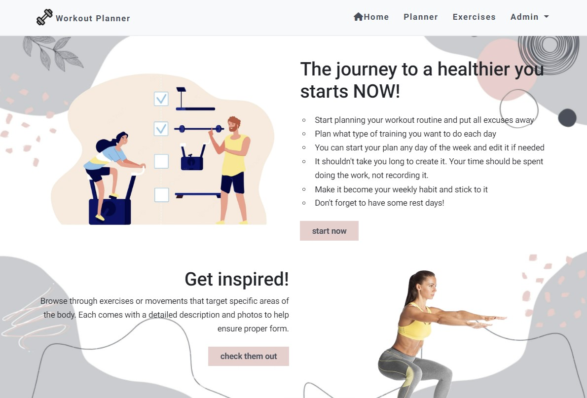
</details>


### Footer
- A footer is displayed at the bottom of the each page
- Contains link to contact form (opening in the same window), social media and GitHub page (opening in a separate window)
- Contains copyrights info
- User stories covered: 16

<details><summary>See feature images</summary>


</details>


### Sign up / Register
- New users can create an account
- The user must provide a valid username, password and password confirmation. Email address is optional
- User cannot register the same details twice for an account
- Once register the users are immediately logged in and taken to the planner page
- User stories covered: 3, 14

<details><summary>See feature images</summary>


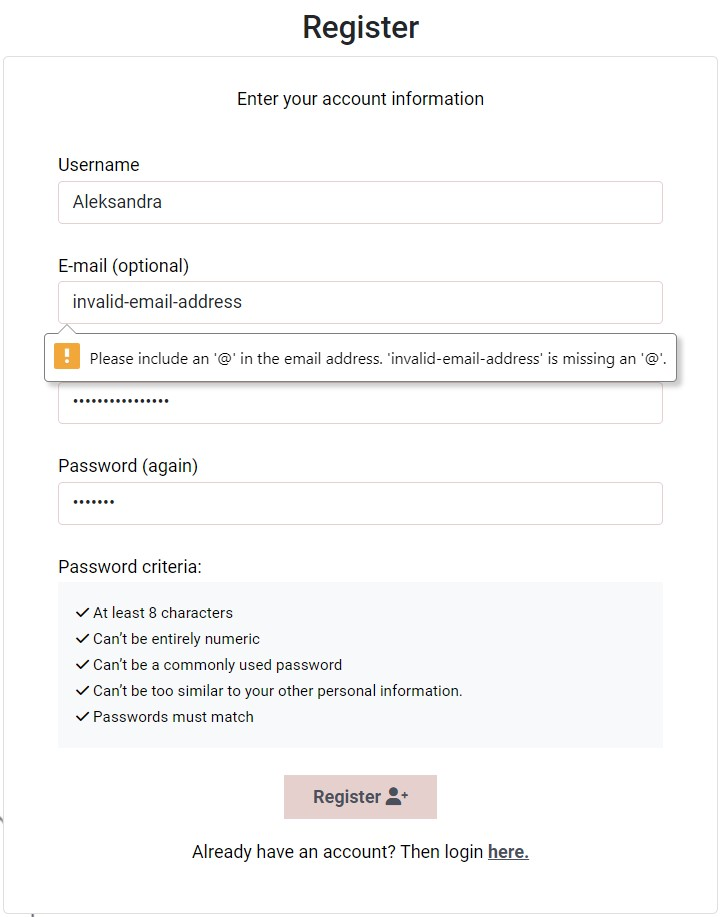
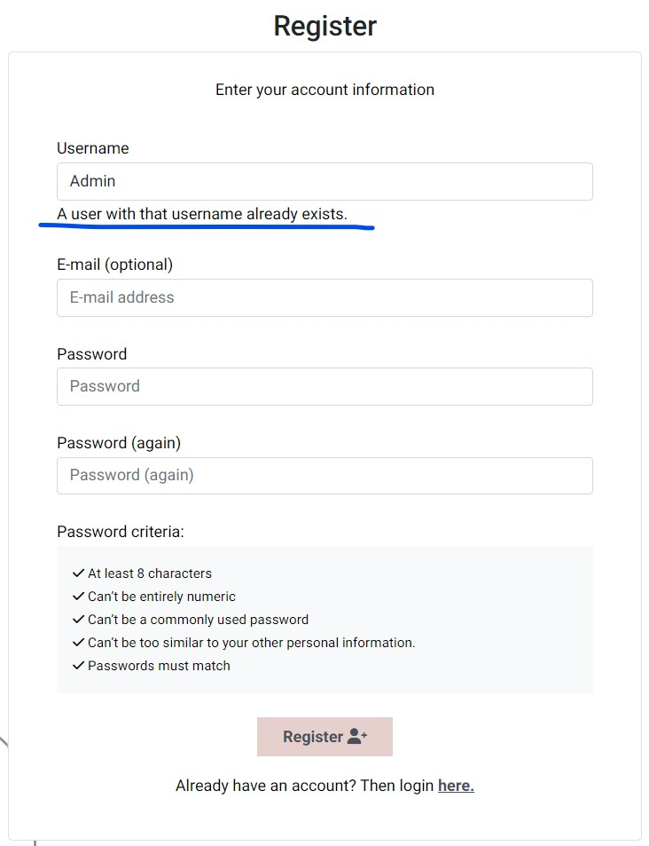
</details>


### Login
- Returning users can login to their account
- The user must have an account in the system and they must enter the correct username and password
- Both fields are mandatory
- Once logged in the user will be navigated to the planner page
- User stories covered: 10, 12, 14

<details><summary>See feature images</summary>


</details>


### Logout
- Confirmation screen for Logged in user to logout from their account 
- User stories covered: 21

<details><summary>See feature images</summary>


</details>


### Profile
- Logged in user can see details about their account and workouts created
- User stories covered: 22

<details><summary>See feature images</summary>

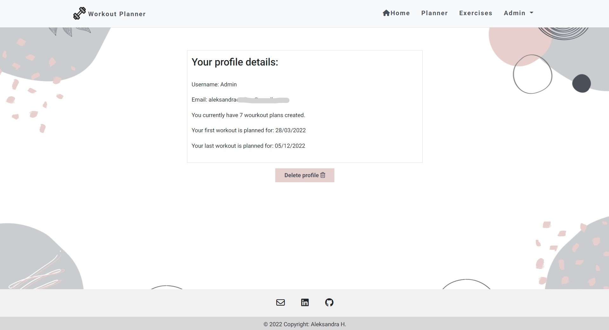
</details>


### Delete account
- User have an option to delete their account from the system.
- The modal pops up for user to confirm their choice and are warned that this action is irreversible
- User stories covered: 23

<details><summary>See feature images</summary>


</details>


### Planner page
- There are two views depending whether a user is logged in or not
  - For users who are not logged in to their account they can see two options to access the planner - log in and sign up. There is also an example of the planner to give user an idea how the ready plan looks like
  - Logged-in users can see the confirmation message that they've been successfully logged in and they are taken back to the planner page where they can select from two options to either view their current plans or add a new one
- User stories covered: 3, 10, 12
<details><summary>See feature images</summary>


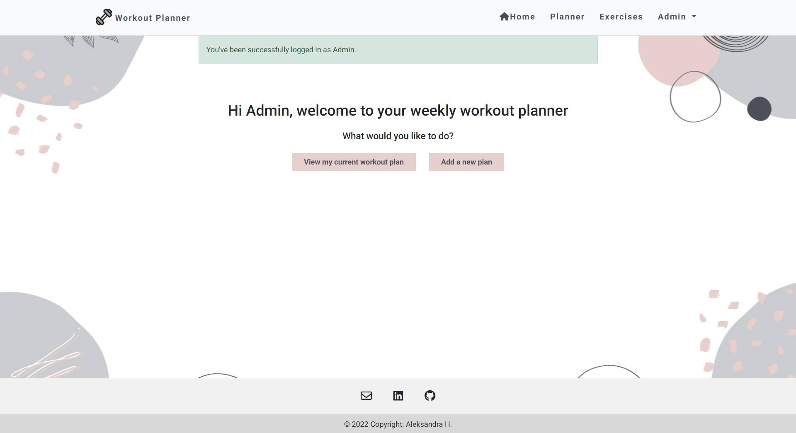
</details>


### Choose date
- User can select the first day of their plan using the date picker
- It is not possible to create two plans starting on the same day. On selection of an incorrect date the user is presented with a warning message to choose another day on the calendar
- User stories covered: 4, 13
  
<details><summary>See feature images</summary>

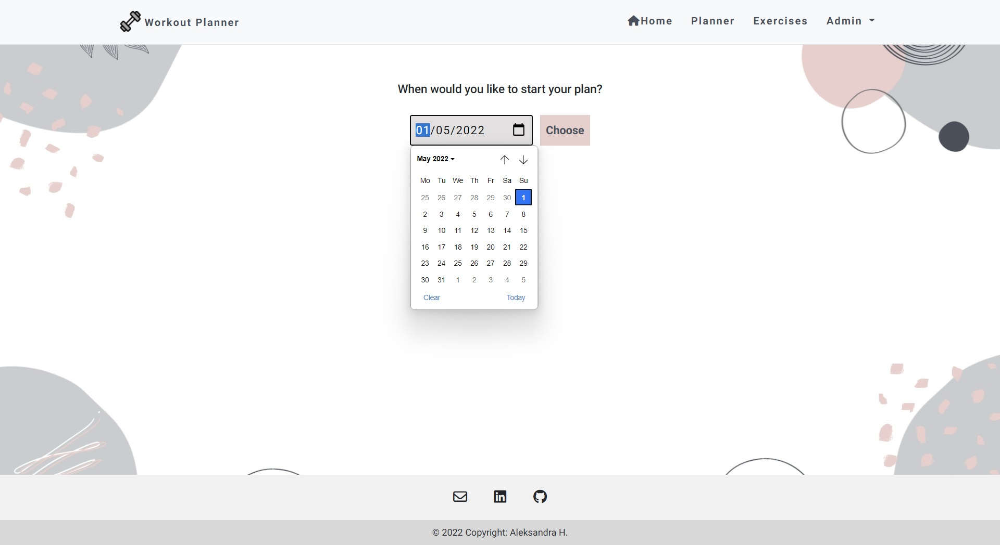

</details>


### Add plan
- User can add plan either from the planner page or the view plans page
- There are 28 input fields representing the workout plan. 14 fields for AM and 14 for PM
- It is possible to leave some fields blank
- For easier navigation on small screen devices the first column is frozen so that user can see it at all times when scrolling right & left between days of the week
- User is provided with a feedback message that their plan has been added
- User stories covered: 4, 13

<details><summary>See feature images</summary>


</details>


### View plans
- User can see all the plans they created
- There is one plan per page displayed with the date at the top of the table
- User can use the right & left navigation arrows to jump between plans
- There are three options available to edit plan, add a new plan or delete the currently viewed plan. These are represented by the font awesome icons below the workout plan table
- For easier navigation on small screen devices the first column is frozen so that user can see it at all times when scrolling right & left between days of the week
- User stories covered: 4, 8

<details><summary>See feature images</summary>


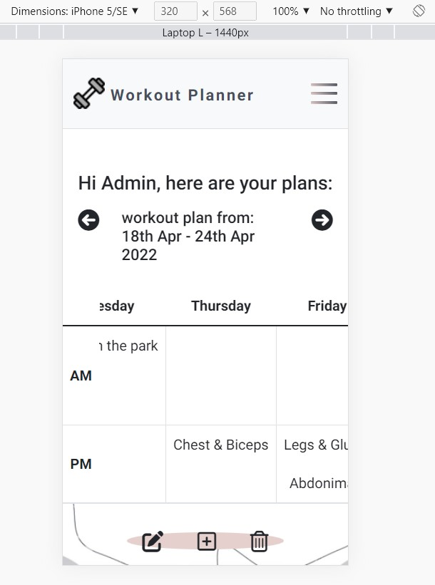
</details>


### Navigation icons
- Located unser the plan in the view plans page
- Allow user to edit, add or delete currently displayed plan on the page
- User stories covered: 5, 6

<details><summary>See feature images</summary>


</details>


### Edit plan
- User can edit a selected plan
- This can be done by clicking the first icon from the navigation icons
- Date of plan currently being edited is displayed above the plan
- User can edit any field and save once happy with edition
- For easier navigation on small screen devices the first column is frozen so that user can see it at all times when scrolling right & left between days of the week
- User is provided with a feedback message that their plan has been edited
- User stories covered: 5

<details><summary>See feature images</summary>


</details>


### Delete plan
- User can delete a selected plan
- This can be done by clicking the third icon from the navigation icons
- The modal pops up for user to confirm the deletion of the plan
- User is provided with a feedback message that their plan has been deleted
- User stories covered: 6

<details><summary>See feature images</summary>

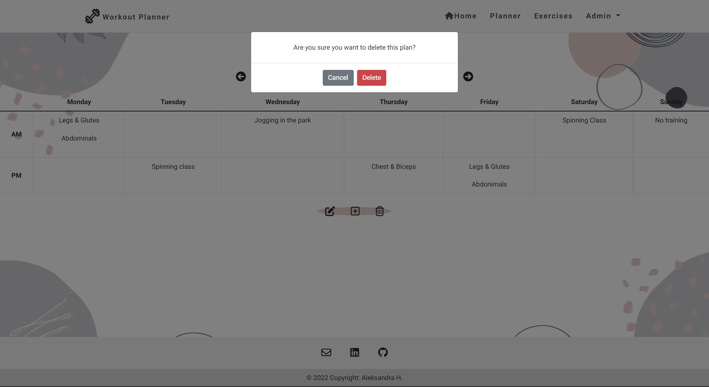
</details>


### Feedback messages
- User is provided with feedback message about the action their performed, eg. added, edited or deleted a plan or logged-in, registered, logged-out, etc.
- User stories covered: 7

<details><summary>See feature images</summary>


</details>


### Exercises list page
- A page with a catalogue of training exercises targeting different body parts, with various level of difficulty and type of training
- User is able to search through all the exercises choosing a specific body part, level of difficulty or type of training. They can also find a specific exercise by typing a part of its name
- User stories covered: 9, 11

<details><summary>See feature images</summary>


</details>


### Exercise filter
- Filter through all the exercises which allows user to find a specific exercise depending on the targetedd body part, level of difficulty or type of training. There is also an option to find an exercise by typing a part of its name
- Filter collapses on smaller screens and expands by clicking on the 'Find an exercise' button
- User stories covered: 9

<details><summary>See feature images</summary>


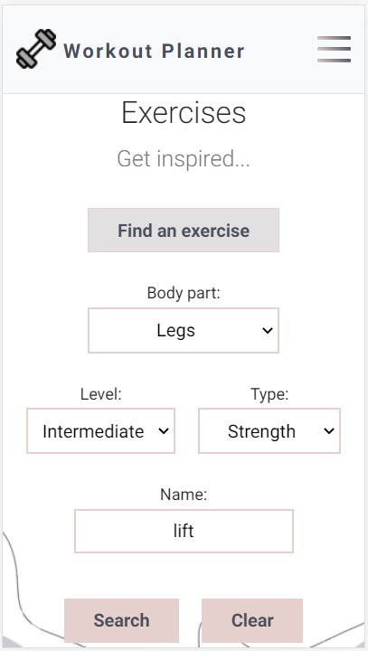

</details>


### Exercise pagination
- Allows for display of twelve exercises per page, if there are more, the page is paginated
- User to go the the previous/next page or the first/last page of exercises
- User stories covered: 20

<details><summary>See feature images</summary>


</details>


### Exercise detail page
- Provides overview of the exercise
- Users can view a detailed description on how to perform the exercise
- User stories covered: 19
  
<details><summary>See feature images</summary>

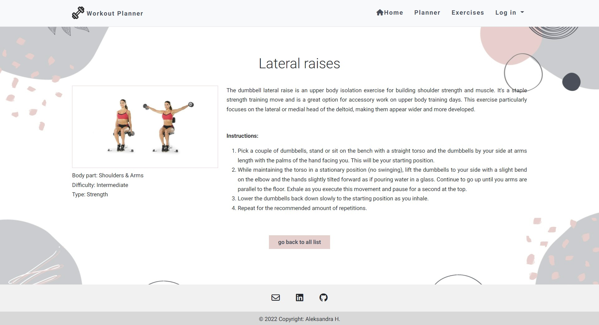
</details>


### Contact form
- Contact form allows user to contact the developer and send their message or provide feedback
- All three fields (username, email and message) on the form are mandatory
- Not logged-in users need to provide their name, email address and message content
- Username on the form is automatically provided for the logged-in user as well as their email address, if one was given during account registration. If not, the user needs to provide their email address manually.
- User stories covered: 16

<details><summary>See feature images</summary>

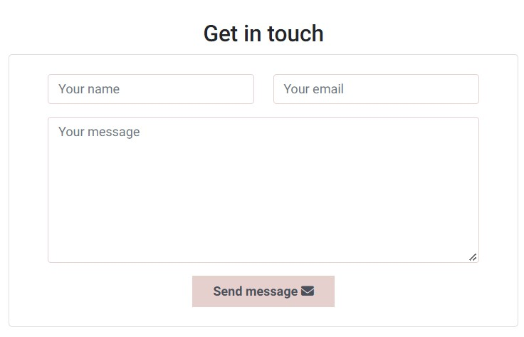


</details>


### Contact form confirmation
- Confirmation message is provided for user that they contact message has been successfully sent
- User stories covered: 17

<details><summary>See feature images</summary>


</details>


### Error pages
- If a user encounters an error, the relevant error page is displayed (400, 403, 404 or 500)
- User stories covered: 15

<details><summary>See feature images</summary>


</details>

##### Back to [top](#table-of-contents)


## Validation

The W3C Markup Validation Service was used to validate the HTML of the website.
<details><summary>Home</summary>

</details>

<details><summary>Planner</summary>

</details>

<details><summary>Choose date</summary>

</details>

<details><summary>Add Plan</summary>

</details>

<details><summary>Edit Plan</summary>

</details>

<details><summary>View Plans</summary>

</details>

<details><summary>Exercises list page</summary>

</details>

<details><summary>Exercise detail page</summary>

</details>

<details><summary>Login</summary>

</details>

<details><summary>Signup</summary>

</details>

<details><summary>Profile</summary>

</details>

<details><summary>Logout</summary>

</details>

<details><summary>Contact form page</summary>

</details>

<details><summary>Error Pages (400, 403, 404, 500)</summary>

</details>

### CSS Validation
The W3C Jigsaw CSS Validation Service was used to validate the CSS of the website. When validating all website, it passes with no errors.

<details><summary>Style.css</summary>

</details>

### JavaScript Validation
JSHint JS Validation Service was used to validate the Javascript files. No errors were found.

<details><summary>Script.js</summary>

</details>

### PEP8 Validation
PEP8 Validation Service was used to check the code for PEP8 requirements. All the code passes with no errors and no warnings to show.

<details><summary>Exercises</summary>

<details><summary>Admin.py</summary>

</details>

<details><summary>Filters.py</summary>

</details>

<details><summary>Models.py</summary>

</details>

<details><summary>Test_views.py</summary>

</details>

<details><summary>Urls.py</summary>

</details>

<details><summary>Views.py</summary>

</details>

<details><summary>Exercises_tags.py</summary>

</details>

</details>

<details><summary>Home</summary>

<details><summary>Models.py</summary>

</details>

<details><summary>Test_views.py</summary>

</details>

<details><summary>Urls.py</summary>

</details>

<details><summary>Views.py</summary>

</details>

</details>

<details><summary>Plannerapp</summary>

<details><summary>Admin.py</summary>

</details>

<details><summary>Forms.py</summary>

</details>

<details><summary>Models.py</summary>

</details>

<details><summary>Test_views.py</summary>

</details>

<details><summary>Urls.py</summary>

</details>

<details><summary>Views.py</summary>

</details>

</details>


### Chrome Dev Tools Lighthouse

Lighthouse was used to test the performance, accessibility, best practice and SEO of the site.
Overall the results are very good for the 4 values.

#### Desktop
<details><summary>View results</summary>

Page  | Performance (%) | Accessibility (%) | Best Practices (%) | SEO (%)
------------  | ------------ | ------------- | ------------- | -------------
home/templates/home/index.html | 99 | 100 | 92 | 100 |
home/templates/home/contact.html | 100 | 100 | 92 | 100 |
home/templates/home/profile.html | 100 | 100 | 92 | 100 |
exercises/templates/exercises/exercises_list.html | 99 | 96 | 92 | 100 |
exercises/templates/exercises/exercise.html | 100 | 100 | 92 | 100 |
plannerapp/templates/plannerapp/add_plan.html | 100 | 93 | 92 | 100 |
plannerapp/templates/plannerapp/choose_date.html | 100 | 93 | 92 | 100 |
plannerapp/templates/plannerapp/edit_plan.html | 100 | 93 | 92 | 100 |
plannerapp/templates/plannerapp/planner.html | 100 | 98 | 92 | 100 |
plannerapp/templates/plannerapp/view_plans.html | 100 | 98 | 92 | 100 |
templates/account/login.html | 100 | 100 | 92 | 90 |
templates/account/signup.html | 100 | 100 | 92 | 100 |
templates/account/logout.html | 100 | 100 | 92 | 100 |

</details>

#### Mobile
<details><summary>View results</summary>

Page  | Performance (%) | Accessibility (%) | Best Practices (%) | SEO (%)
------------  | ------------ | ------------- | ------------- | -------------
home/templates/home/index.html | 99 | 100 | 92 | 100 |
home/templates/home/contact.html | 99 | 100 | 92 | 100 |
home/templates/home/profile.html | 99 | 100 | 92 | 100 |
exercises/templates/exercises/exercises_list.html | 75 | 98 | 92 | 100 |
exercises/templates/exercises/exercise.html | 99 | 100 | 92 | 100 |
plannerapp/templates/plannerapp/add_plan.html | 99 | 93 | 92 | 100 |
plannerapp/templates/plannerapp/choose_date.html | 99 | 92 | 92 | 100 |
plannerapp/templates/plannerapp/edit_plan.html | 98 | 93 | 92 | 100 |
plannerapp/templates/plannerapp/planner.html | 99 | 98 | 92 | 100 |
plannerapp/templates/plannerapp/view_plans.html | 97 | 98 | 92 | 100 |
templates/account/login.html | 98 | 100 | 92 | 92 |
templates/account/signup.html | 99 | 100 | 92 | 100 |
templates/account/logout.html | 99 | 100 | 92 | 100 |

</details>

### Wave
The WAVE WebAIM web accessibility evaluation tool was used to test the websites accessibility.

<details><summary>Home page</summary>

</details>

<details><summary>Contact page</summary>
- Initially there were 3 errors shown for no labels to input fields. This was fixed by adding labels and setting bootstrap class to sr-only.


</details>

<details><summary>Profile page</summary>

</details>

<details><summary>Exercises list</summary>

</details>

<details><summary>Exercise detail page</summary>

</details>

<details><summary>Choose date page</summary>

</details>

<details><summary>Add plan</summary>

- There were 28 errors identified related to missing form labels which were fixed and as a result there are no more errors identified. Same issues for edit plan page.
  

</details>

<details><summary>Edit plan</summary>

</details>

<details><summary>Planner page</summary>

- Initially there was one error related to the empty table header (1st th element), which was fixed by addiding value to the th element and setting 'visibility: none';


</details>

<details><summary>View plans</summary>

- A few errors related to empty links of navigation icons were corrected by adding aria-hidden='true' and setting bootstrap class to sr-only.
  

</details>

<details><summary>Login</summary>

</details>

<details><summary>Register</summary>

</details>

<details><summary>Logout</summary>

</details>

<details><summary>Error page</summary>

</details>

##### Back to [top](#table-of-contents)


## Testing

The testing approach is as follows:
1. Manual testing of user stories
2. Automated testing

### Manual testing of user stories

1. I want to see the home page with explanation of the app

**Step** | **Expected Result** | **Actual Result**
------------ | ------------ | ------------ |
Navigate to https://ci-pp4-workout-planner.herokuapp.com/ | Home page main body loads with application description | Works as expected |

<details><summary>Screenshot</summary>

</details>


2. I want to be able to easily navigate around the application to different pages

**Step** | **Expected Result** | **Actual Result**
------------ | ------------ | ------------ |
Click on 'Home' link on the navigation bar | Loads home page | Works as expected |
Click on 'Planner' link on the navigation bar | Loads planner page | Works as expected |
Click on 'Exercise' link on the navigation bar | Loads exercises page | Works as expected |
Click on User name on the navigation bar and then 'Profile' from the drop-down menu| Loads user profile page | Works as expected |
Click on User name on the navigation bar and then 'Log out' from the drop-down menu| Loads log out page | Works as expected |

<details><summary>Screenshot</summary>


</details>


3. I want to create my account to be able to plan my workouts

**Step** | **Expected Result** | **Actual Result**
------------ | ------------ | ------------ |
Select 'Log in' on the navigation bar and 'Register' from the drop-down menu | Loads Registration page | Works as expected |
Provide username | Shows error if username is shorter than 4 characters | Works as expected |
Provide password  | Shows error if password don't meet password criteria | Works as expected |
Click 'Register' button at the bottom of the form | User is logged-in, taken to the planner page and presented with a confirmation message | Works as expected |

<details><summary>Screenshot</summary>


</details>


4. I want to prepare a plan for multiple weeks in advance

**Step** | **Expected Result** | **Actual Result**
------------ | ------------ | ------------ |
Register or log in to the account to be able to create a plan | Loads planner page | Works as expected |
Click on the 'Add a new plan' button | Display a choose date page with a date picker | Works as expected |
Select first day for the plan and click 'Choose' | Loads add plan page with selected first day of the week  | Works as expected |
Fill in the plan and click 'Add plan' button | Loads view plans page with completed plan | Works as expected |
Click on the 2nd icon (Plus sign) from the navigation icons below the current plan and repeat two above steps | Create a new plan with a different start day | Works as expected |
Select first day from the date picker which has already been selected | Show error message and clear date picker for another selection | Works as expected |

<details><summary>Screenshot</summary>


</details>


5. I want to be able to edit my current plans at any point

**Step** | **Expected Result** | **Actual Result**
------------ | ------------ | ------------ |
In the view plans page click on the 1st icon from the navigation icons below the current plan | Loads edit page for selected workout plan | Works as expected |
Edit the plan and click on 'Save' button | Loads view plans page, displays confirmation message and shows amended plan | Works as expected |

<details><summary>Screenshot</summary>


</details>


6. I want to delete my plan if no longer needed

**Step** | **Expected Result** | **Actual Result**
------------ | ------------ | ------------ |
In the view plans page click on the 3rd icon from the navigation icons below the current plan | Displays confirmation modal | Works as expected |
Click on 'Delete' on the pop up modal | Deletes selected plan and displays confirmation message. Show current plans and if no plans are saved a relevant message for user | Works as expected |

<details><summary>Screenshot</summary>


</details>

7.  I want to see feedback messages so that I know that my plan was created, edited or deleted

**Step** | **Expected Result** | **Actual Result**
------------ | ------------ | ------------ |
Click on the 'Add a new plan' button on planner page, fill in the plan and click 'Add plan' button | Loads view plans page with completed plan | Works as expected |
 | Loads edit page for selected workout plan | Works as expected |
In the view plans page click on the 1st icon from the navigation icons below the current plan, edit the plan and click on 'Save' button | Loads view plans page, displays confirmation message and shows amended plan | Works as expected |
In the view plans page click on the 3rd icon from the navigation icons below the current plan, click on 'Delete' on the pop up modal | Deletes selected plan and displays confirmation message. Show current plans and if no plans are saved a relevant message for user | Works as expected |

<details><summary>Screenshot</summary>


</details>


8.  I want to be able to view previous plans to help me prepare the following week’s workout

**Step** | **Expected Result** | **Actual Result**
------------ | ------------ | ------------ |
Register or log in to the account to be able to view all plans | Loads planner page | Works as expected |
Click on 'View my current workout plans' button | Loads view plans page | Works as expected |
Use right & left arrows to navigate between created plans | Display previous & next plan | Works as expected |

<details><summary>Screenshot</summary>


</details>


9.  I want to find inspiration for my workouts and be able to use search option to find a particular exercise

**Step** | **Expected Result** | **Actual Result**
------------ | ------------ | ------------ |
Click on the 'Exercises' menu on the navigation bar | Loads exercises list page paginated by 12 | Works as expected |
Use filter to search a specific exercise depending on the body part, level or type | Displays exercises matching users criteria | Works as expected |
Type a name or part of the exercise name and click on the 'Search' button | Loads exercises containing searched phrase in their title | Works as expected |
Click on 'Clear' button to remove filter and display list of all exercises | Loads exercises list paginated by 12 | Works as expected |
Click on '>>' button in the pagination feature to go to the next page displaying next 12 exercises | Loads next 12 exercises from all exercises in the database | Works as expected |

<details><summary>Screenshot</summary>


</details>


10. As a returning user, I want to log in to the app to see my current plans

**Step** | **Expected Result** | **Actual Result**
------------ | ------------ | ------------ |
Click on 'Log in' on the navigation bar and 'Log in' from the drop-down menu | Loads Log in page | Works as expected |
Provide incorrect username & password | Shows error if username and/or password are not correct | Works as expected |
Provide correct username & password | Logs user in and loads a planner page. Displays confirmation message and username on the page screen and nav bar | Works as expected |
Click 'View my current workout plans' on the planner page | Loads view plans page | Works as expected |

<details><summary>Screenshot</summary>


</details>


11. I want every site visitor to be able to view the catalogue of exercises
    
**Step** | **Expected Result** | **Actual Result**
------------ | ------------ | ------------ |
Click on 'Exercises' on the navigation bar | Loads exercises list page | Works as expected |

<details><summary>Screenshot</summary>

</details>


##### Back to [top](#table-of-contents)


12. I want only the logged-in users to be able to create their plans

**Step** | **Expected Result** | **Actual Result**
------------ | ------------ | ------------ |
Click on 'Planner' on the navigation bar | For not logged-in users displays an example of the plan and option to log in or register | Works as expected |

<details><summary>Screenshot</summary>

</details>


13. I want users to be able to create the plan on any day that suits their needs

**Step** | **Expected Result** | **Actual Result**
------------ | ------------ | ------------ |
On planner page click 'Add a new plan' | Displays choose date page with a day picker | Works as expected |
Select any date on the calendar other than Monday, eg. Wednesday | Displays add plan page with Wednesday as the first day of the plan | Works as expected |
Choose other date of the week as a first day, eg. Saturday | Displays add plan page with Saturday as the first day of the plan | Works as expected |

<details><summary>Screenshot</summary>


</details>


14. I want data entry to be validated on sign-up page

**Step** | **Expected Result** | **Actual Result**
------------ | ------------ | ------------ |
Click on the 'Log in' on the nav bar and 'Register' from the drop-down menu | Displays Registration page | Works as expected |
Input username shorter than 4 characters (eg. xyz) | Prevents registration. Shows warning message to lenghten username text  | Works as expected |
Input username which has already been taken (eg. Admin) | Prevents registration. Displays 'A user with that username already exists.' message | Works as expected |
Input incorrect format of email | Shows warning message to include '@' in the email. Prevents registration | Works as expected |
Input 'newuser12' password |  Prevents registration. Displays 'The password is too similar to the username' message | Works as expected |
Input '12345678' as a password | Prevents registration. Displays 'This password is entirely numeric' message | Works as expected |
Input 'testing' as a password | Prevents registration. Displays 'This password is too short. It must contain at least 8 characters' message | Works as expected |
Input two different values in 'Password' and 'Password (again)' fields | Prevents registration. Displays 'You must type the same password each time.' message | Works as expected |

<details><summary>Screenshot</summary>


</details>


15. I want the user to come to a 404 error page instead of having to use the browser back button if they enter a URL that does not exist
    
**Step** | **Expected Result** | **Actual Result**
------------ | ------------ | ------------ |
Type the wrong page in the www address | Reroute to a customised 404 page | Works as expected |

<details><summary>Screenshot</summary>


</details>


16. I want user to be able to contact me and provide their feedback

**Step** | **Expected Result** | **Actual Result**
------------ | ------------ | ------------ |
Click on the envelope icon in the footer | Displays contact page with contact form | Works as expected |
For user who is not logged-in fill in username, email and message fields and click 'Send message' | Initially displays contact form with no data in and after completion sends the form | Works as expected |
For user who is logged-in and did not provide email on registration, fill in email and message fields and click 'Send message' | Initially displays contact form with prepopulated username and after input of email and message sends the form | It did not work when tested. User email was not shown in the received email. The code in home views.py was corrected and the feature re-tested. As documented in the screenshot below, it now works as expected. |
For user who is logged-in and provided email on registration, fill in the message fields and click 'Send message' | Initially displays contact form with prepopulated username and email address and sends the form with user message | Works as expected |

<details><summary>Screenshot</summary>


</details>


17. I want user to receive feedback if their message in contact form has been sent.

**Step** | **Expected Result** | **Actual Result**
------------ | ------------ | ------------ |
Click on the envelope icon in the footer | Displays contact page with contact form | Works as expected |
Fill in required contact form fields and click 'Send message' button | Display confirmation message to the user | Works as expected |

<details><summary>Screenshot</summary>


</details>


18. I want my site to be fully responsive

**Step** | **Expected Result** | **Actual Result**
------------ | ------------ | ------------ |
Change device screen size using chrome dev tools | The web functionality remains the same on various screen sizes | Works as expected |

<details><summary>Screenshot</summary>


</details>


19. I want to see details of a specific exercise and get an idea how to perform it correctly

**Step** | **Expected Result** | **Actual Result**
------------ | ------------ | ------------ |
Navigate to exercise page in the navigation bar | Displays the list of all exercises paginated by 12 | Works as expected |
Click 'View' button under an exercise picture and overview | Displays the selected exercise detail page | Works as expected for both logged in and not logged in user |

<details><summary>Screenshot</summary>


</details>


20. I want a paginated list of exercises so that I can easily select an exercise to view

**Step** | **Expected Result** | **Actual Result**
------------ | ------------ | ------------ |
Navigate to exercise page in the navigation bar | Displays the list of all exercises paginated by 12 | Works as expected |
Click on the '»' symbol to go to the next page | Displays next available page | Works as expected |
Click on the '»»' to jump to the last page | Displays last page | Works as expected  |
Click on the '«' symbol to go to the previous page | Displays previous available page | Works as expected |
Click on the '««' to jump to the first page | Displays first page | Works as expected  |
Put a filter on exercises and select only exercises for legs from the body part filter and click 'Search' | Displays only exercises matching the search criteria | Works as expected |
Test '»»' & '««' symbols to jump to the last / first page | Displays last / first page available | Works as expected |

<details><summary>Screenshot</summary>


</details>


21. I want to be able to log out from my account

**Step** | **Expected Result** | **Actual Result**
------------ | ------------ | ------------ |
On navigation bar click on username and select 'Log out' from the drop-down menu | Displays the log out page | Works as expected |
Click on the 'Log out' button | Logs user out and displays confirmation message | Works as expected |


<details><summary>Screenshot</summary>


</details>


22. I want to be able to see details of my account on the profile page

**Step** | **Expected Result** | **Actual Result**
------------ | ------------ | ------------ |
On navigation bar click on username and select 'Profile' from the drop-down menu | Displays the profile page | Works as expected |

<details><summary>Screenshot</summary>


</details>


23.  I want to be able to delete my account if I decide to no longer use the app

**Step** | **Expected Result** | **Actual Result**
------------ | ------------ | ------------ |
On navigation bar click on username and select 'Profile' from the drop-down menu | Displays the profile page | Works as expected |
Click on the 'Delete profile' button | Pops up modal to confirm user's decision and warns about the irreversibility of this action | Works as expected |
Click on the 'Delete' button to confirm the choice | Deletes the user account and displays the message on the main screen | Works as expected |

<details><summary>Screenshot</summary>


</details>


### Automated testing

Automated testing was done using the Django's unit tests from a Python standard library module: unittest. The reports were produced using the coverage tool.

- Exercises app:


- Home app:


- Plannerapp app:


### Performing tests on various devices

The website was tested using Google Chrome Developer Tools Toggle Device Toolbar to simulate viewports of different devices.

The website was tested on the following devices:
- ASUS ZenBook (tablet screen)
- Samsung Galaxy Tab A (tablet screen)
- Samsung S7 (mobile screen)

### Browser compatibility

- Testing has been carried out on the following browsers:
  - Googe Chrome Version 101.0.4951.41 (Official Build) (64-bit)
  - Firefox Browser 99.0.1 (64-bit)
  - Microsoft Edge Version 101.0.1210.32 (Official build) (64-bit)

##### Back to [top](#table-of-contents)


## Bugs

| **Bug** | **Fix** |
| ------- | ------- |
| The post method on the date selector did not work properly | Renamed function to 'post', removed 'if request.method == "POST":'. Also standardised the nomenclature of files - changed ‘-‘ to ‘_’ |
| The session ID for the planner could not be obtained | Changed `"request.session[workout_plan.pk] = workout_plan.id"` into `"request.session['workout_plan.id'] = workout_plan.pk"` |
| Unable to save forms from formset due to row containing null values | Added properties to WorkoutPlan models (blank=True, null=False, default='',) |
| Validation:  button being a descendant of an element and vice-versa `(e.g. <a href="/planner"><button type="button" class="button">start now</button></a>` | Made an a tag with a class of link-button (`<a href="/planner" class="link-button mt-2">start now</a>`)|
| Duplicated code of exercise filters with its appearence on the page was set with CSS and media queries which was causing html errors due to duplicated ID tags | Removed duplicated code and wrote JavaScript function to adjust filter drop-down and functionality on the smaller screens |
| Validation: wave tool identified 3 errors due to no labels to input fields | Fixed by adding labels and setting bootstrap class to sr-only |
| Validation: wave tool identified 28 errors for missing form fields labels in add plan and edit plan page | Added labels with no visibility set |
| Validation: error identified for missing 1st table header field | Added value to the th element and set 'visibility: none'; |
| Validation: wave tool identified a few error for empty links of navigation icons | Added aria-hidden='true' and set bootstrap class to sr-only |
| Testing: no email address shown on email from logged-in user who had to manually input their address to the field on the contact form | Amended view to display contact form in views.py by adding nested if function in `if request.user.is_authenticated` |

##### Back to [top](#table-of-contents)


## Configuration

### Google emails

To set up the project to send emails and to use a Google account as an SMTP server, the following steps are required:

1. Create an email account at google.com, login, click you user icon and then on 'Manage Your Google Account'
2. Click on the Security tab
3. Turn on 2-step verification and follow the steps to enable
4. Click on App passwords, click on Select app and choose Other
5. Give your app a name and click on 'Generate'
<br>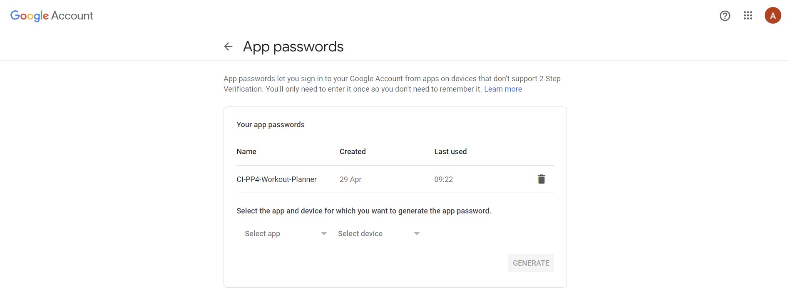
6. A 16 digit password will be generated, note the password down
7. Set the below variables within the settings.py file to successfully send emails
<br><code>EMAIL_BACKEND = 'django.core.mail.backends.smtp.EmailBackend'</code>
<br><code>EMAIL_HOST = 'smtp.gmail.com'</code>
<br><code>EMAIL_HOST_USER = os.environ.get('EMAIL_HOST_USER')</code>
<br><code>EMAIL_HOST_PASSWORD = os.environ.get('EMAIL_HOST_PASSWORD')</code>
<br><code>EMAIL_PORT = '587'</code>
<br><code>EMAIL_USE_TLS = True</code>
8. Set up the variables EMAIL_HOST_USER and EMAIL_HOST_PASSWORD in your Heroku application (Settings -> Config Vars)


### Heroku Deployment
This application has been deployed from GitHub to Heroku by following the steps:

1. Create or log in to your account at heroku.com
2. Create a new app, add a unique app name (this project is named "ci-pp4-workout-planner") and choose your region
3. Click on create app
4. Under resources search for postgres, and add a Postgres database to the app
5. Install the plugins dj-database-url and psycopg2-binary
6. Install django and gunicorn
7. Add the list of requirements by writing in the terminal "pip3 freeze --local > requirements.txt"
8. Create a Procfile in your app: 
   ```
   wsgi:PROJECT_NAME.wsgi
   ```
   (web: gunicorn workout_planner.wsgi)
9.  In the settings.py ensure the connection is to the Heroku postgres database
10. Ensure Debug is set to False in the settings.py file
11. Add localhost/127.0.0.1, and ci-pp4-workout-planner.herokuapp.com to the ALLOWED_HOSTS variable in settings.py
12. Go to Settings in your Heroku and set the environment variables in the Config Vars
    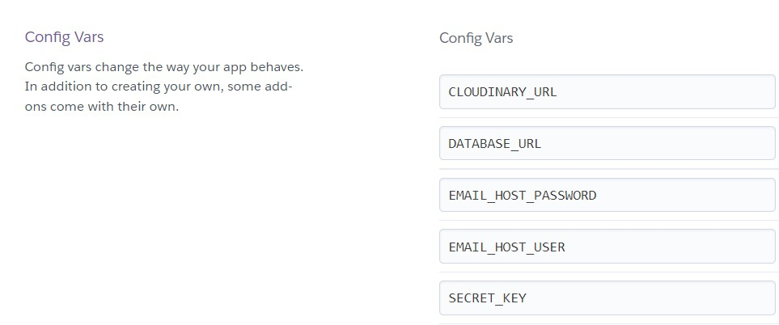
13. Remove DISABLE_COLLECTSTATIC from Heroku settings
14. Push the code to Heroku using the command git push heroku main

Final steps:

- Go to "Deploy" in the menu bar on the top
- Deployment method: Heroku Git (direct connection to GitHub is no longer available)
- Follow steps as shown:
  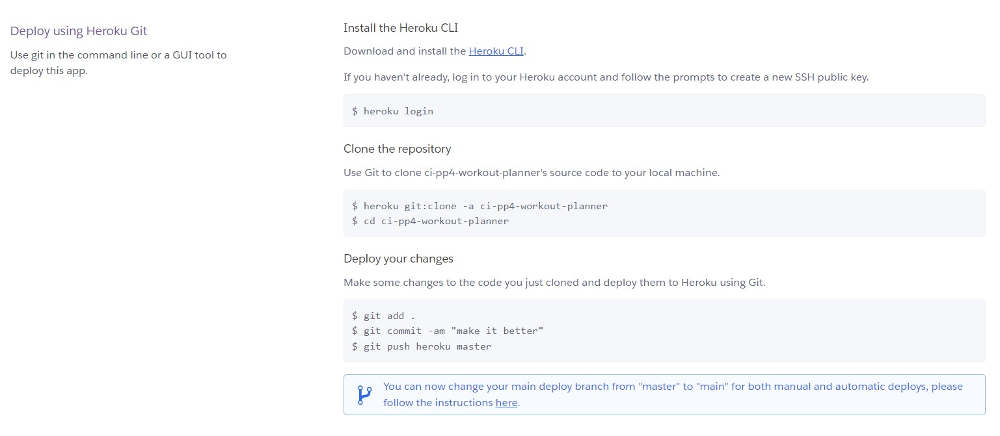


### Forking the GitHub Repository
1. Go to the GitHub repository
2. Click on Fork button in top right corner
3. You will then have a copy of the repository in your own GitHub account.
   
### Making a Local Clone
1. Go to the GitHub repository 
2. Locate the Code button above the list of files and click it
3. Highlight the "HTTPS" button to clone with HTTPS and copy the link
4. Open commandline interface on your computer
5. Change the current working directory to the one where you want the cloned directory
6. Type git clone and paste the URL from the clipboard 
  ```
  $ git clone https://github.com/aleksandracodes/CI_PP4_Workout_Planner
  ```
7. Press Enter to create your local clone

##### Back to [top](#table-of-contents)


## Credits

- [Bodybuilding.com](https://www.bodybuilding.com/exercises/) & [Regainedwellness](https://www.regainedwellness.com/kneeling-squat/) for description of the exercises used within this app

### Images

**Images used in this app were found via Google Search Engine. I'm not able to list all the sources but would like to emphasise that I'm not the author of any of them, except for the background image**
- Some pictures used in this app were taken from the CrossFit® youtube channel (screenshot), e.g. bench press
- Picture of Hip thrust exercise taken from [here](https://www.gofitnessplan.com/images/exercises/female/hip-thrust.jpg)
- Picture of Pull up exercise taken from [here](https://www.climbing.com/skills/training-perfect-pullups-for-climbing-strength/)
- Picture of Triceps kick back taken from [here](https://www.coachmag.co.uk/triceps-exercises/6913/how-to-do-the-triceps-kick-back)
- Picture of Romanian Deadlift exercise taken from [here](https://www.thekuproject.com/romanian-deadlift-joint-angle-and-bar-placement/)
- Picture of Broad jump exercise taken from [here](https://gmb.io/jump-tutorial/)
- Picture of Jumping Jack exercise taken from [here](https://www.istockphoto.com/illustrations/jumping-jack-cartoon)
- Picture of Hammer Curls exercise taken from [here](https://www.vectorstock.com/royalty-free-vector/woman-doing-dumbbell-bicep-hammer-curls-vector-39144519)
- Home page images: [feepik](https://www.freepik.com/premium-vector/personal-training-concept-coach-athlete-vector-characters-training-plan-flat-fitness-illustration-training-personal-fitness-gym-exercise-workout_11293467.htm) & [PNG ALL](https://www.pngall.com/workout-png/download/43673)
- [This](https://media.istockphoto.com/vectors/sport-trauma-vector-illustration-vector-id1265164407?k=20&m=1265164407&s=612x612&w=0&h=URdjumpMbhR5ZnpioEXsQtO4bY8mL7z04wt1ZxIqlC4=) picture was used for error pages
- The background image was created by the developer with [Canva](https://www.canva.com/)

### Code

- How to create sign in and out page inspired by [this tutorial](https://www.youtube.com/watch?v=PtQiiknWUcI) later in the developement replaced using django allauth
- How to render formatted text in the admin area on the website by [GitHub](https://github.com/summernote/django-summernote)
- How to represent day of the week with names instead of dates – [source](https://docs.djangoproject.com/en/dev/ref/templates/builtins/?from=olddocs#date)
- [Youtube tutorial](https://www.youtube.com/watch?v=nle3u6Ww6Xk) on how to create exercise filter
- Model forms:
  - [Youtube tutorial](https://www.youtube.com/watch?v=I2-JYxnSiB0) explaining model forms and forms widget
  - GET and POST methods on forms - [source](https://docs.djangoproject.com/en/4.0/topics/forms/#:~:text=Django's%20login%20form%20is%20returned,this%20to%20compose%20a%20URL)
  - ModelForm and save() method - [source](https://docs.djangoproject.com/en/dev/topics/forms/modelforms/)
- FormSets:
  - [Geeksforgeeks](https://www.geeksforgeeks.org/django-formsets/) brilliant tutorial on how to create and use Django formsets
  - [Stackoverflow](https://stackoverflow.com/questions/40119792/django-model-formset-factory-and-forms) - template for formset using {{formset.management_form}}
  - [Youtube tutorial](https://www.youtube.com/watch?v=JIvJL1HizP4&t=8s) with explanation of Form Set Factory
  - [Stackoverflow](https://stackoverflow.com/questions/11481499/django-iterate-number-in-for-loop-of-a-template) used for creating a table with forllop counter
  - [Youtube tutorial](https://www.youtube.com/watch?v=6wHx-X1tEiY) was used for EditPlan class get method
  - [This source](https://dev.to/greenteabiscuit/deleting-the-form-field-label-in-django-1i20) was used to learn how to delete the form field label in the planner
- Lear about [form widgets](https://docs.djangoproject.com/en/4.0/ref/forms/widgets/)
- [Stackoverflow](https://stackoverflow.com/questions/8609192/what-is-the-difference-between-null-true-and-blank-true-in-django) explanation between blank & null in the database
- Pagination used in the view_plans page explained in the course materials from Code Institute
- Pagination with filters created using [Youtube tutorial](https://www.youtube.com/watch?v=dkJ3uqkdCcY&t=1138s) and [caktusgroup.com](https://www.caktusgroup.com/blog/2018/10/18/filtering-and-pagination-django)
- Feedback messages taken from Code Institute 'I think therefore I blog' walkthrough project
- Collapsible navbar effect created with this [Youtube tutorial](https://www.youtube.com/watch?v=_MrShB9fh7U)
- How to send emails with Django and Gmail – [Youtube](https://www.youtube.com/watch?v=xNqnHmXIuzU&list=PLCC34OHNcOtrZnQI6ZLvGPUWfQ6oh-D6H&index=9)  & [dev.to](https://dev.to/abderrahmanemustapha/how-to-send-email-with-django-and-gmail-in-production-the-right-way-24ab)
-	Sticky first column in the table created with help of [this source](https://write.corbpie.com/bootstrap-sticky-first-column-horizontal-scrolling-table/)
- Arrows for plans pagination taken from [here](https://www.toptal.com/designers/htmlarrows/arrows/)
- [Stackoverflow](https://stackoverflow.com/questions/59598460/need-help-to-save-different-unique-date-in-django/59598515#59598515) - prevent choosing the same start day if the plan already exists
- [Stackoverflow](https://stackoverflow.com/questions/11293380/django-catching-integrity-error-and-showing-a-customized-message-using-template/29000608#29000608) - catch Integrity Error and show a customized message using template

##### Back to [top](#table-of-contents)

## Acknowledgements

I would like to thank everyone who supported me in the development of this project:
- Code Institute Tutors for their great assistance
- My mentor Mo for professional guidance and helpful feedback
- Code Institute community on Slack for resources and support
- Friends and family for words of encouragement
