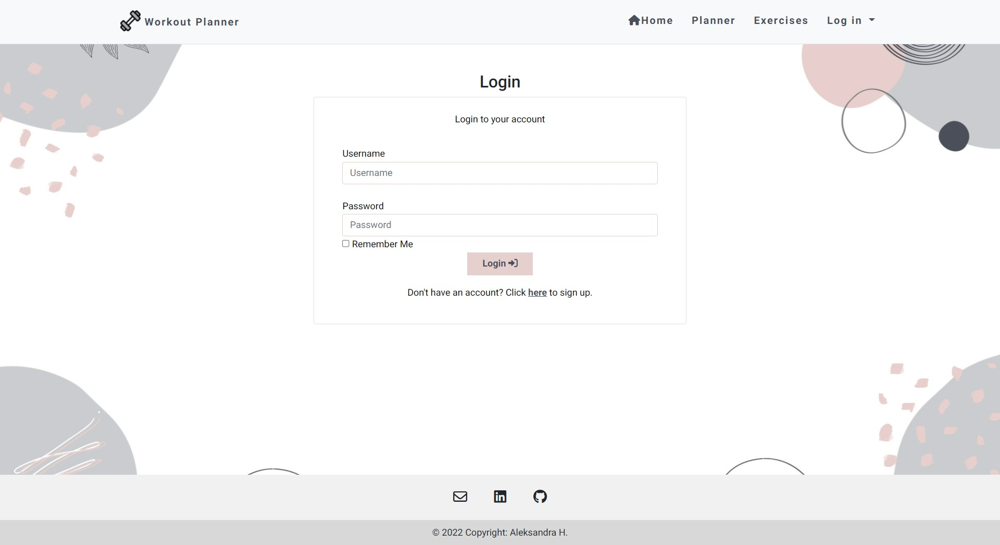
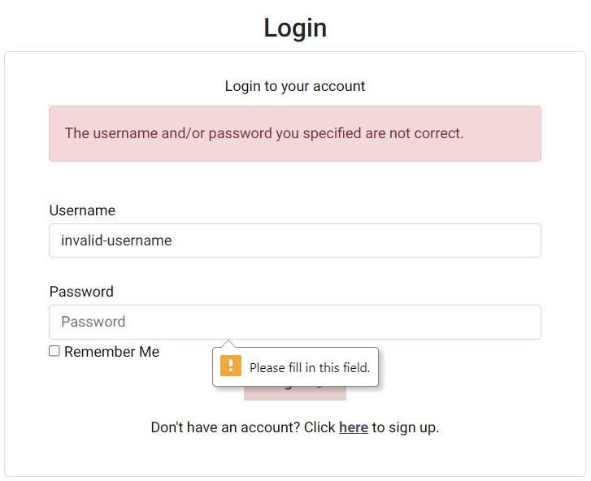
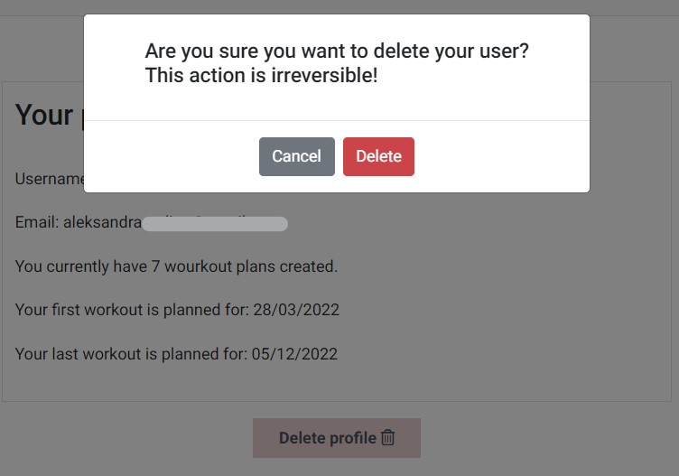
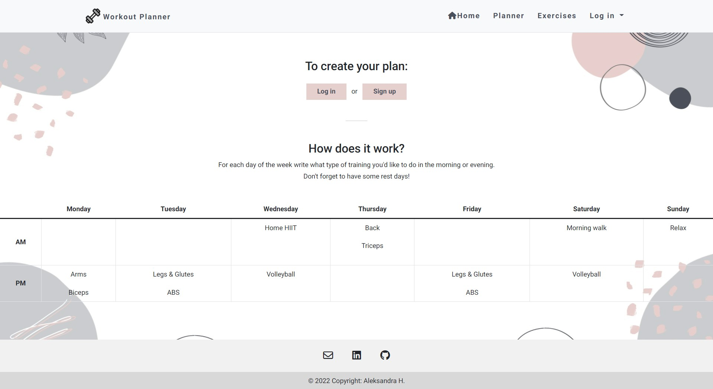
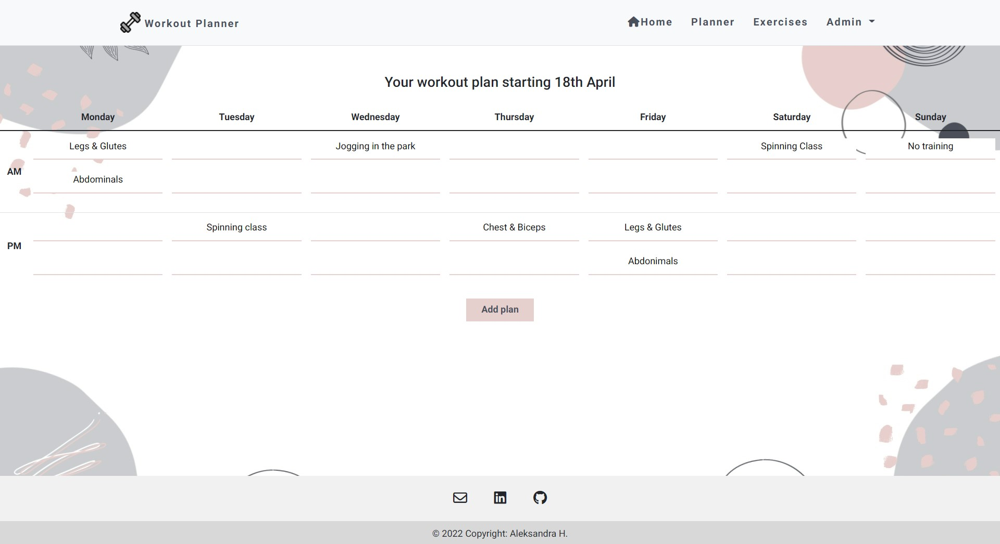
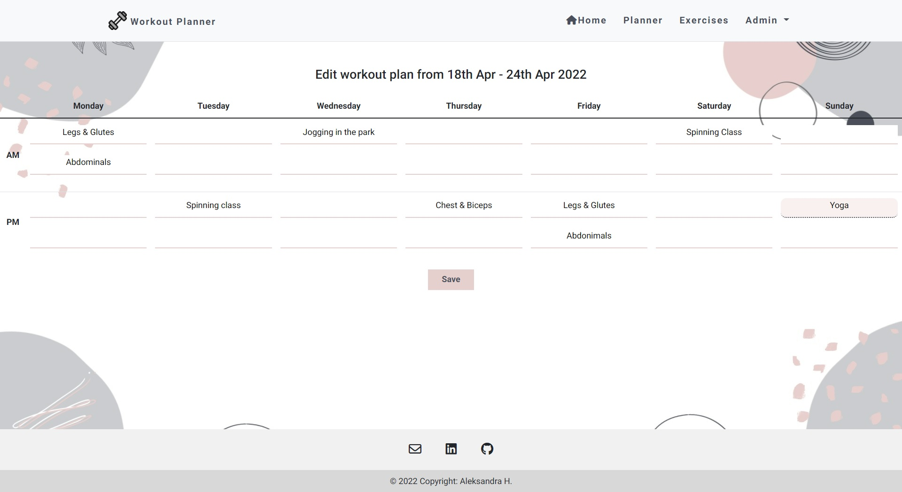
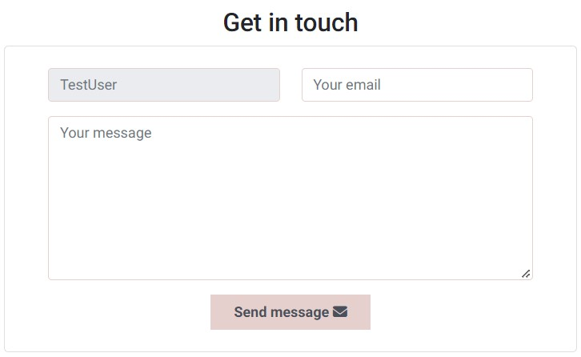

# Workout Planner 

**Developer: Aleksandra Haniok**

💻 [Visit live website](https://ci-pp4-workout-planner.herokuapp.com/)

## Table of Contents
  - [About](#about)
  - [Table of Contents](#table-of-contents)
    - [About](#about-1)
    - [User Goals](#user-goals)
    - [Site Owner Goals](#site-owner-goals)
  - [User Experience](#user-experience)
    - [Target Audience](#target-audience)
    - [User Requirements and Expectations](#user-requirements-and-expectations)
  - [User Stories](#user-stories)
    - [Users](#users)
    - [Site Owner](#site-owner)
  - [Design](#design)
    - [Colour](#colour)
    - [Fonts](#fonts)
    - [Structure](#structure)
    - [Wireframes](#wireframes)
  - [Technologies Used](#technologies-used)
    - [Languages](#languages)
    - [Frameworks, Libraries & Tools](#frameworks-libraries--tools)
  - [Features](#features)
  - [Validation](#validation)
  - [Testing user stories](#testing-user-stories)
  - [Bugs](#bugs)
  - [Deployment](#deployment)
  - [Credits](#credits)
  - [Acknowledgements](#acknowledgements)

### About

The Workout Planner is an application for creating weekly training rota which also gives users ideas of exercises for their next training session.

### User Goals

- Be able to plan their workouts
- Be able to amend their plan at any point
- View the plan at any time

### Site Owner Goals

- Provide an online solution for users to plan their weekly workouts
- Create visually appealing design
- Provide fully responsive application with straightforward navigation

## User Experience

### Target Audience
- People who want to be more organised with their workouts
- Gym enthusiasts who focus on training different body parts and want to plan their weekly schedule to potentially avoid repetitions in their training
- People who want to keep track of their workout/fitness routine
- People who don’t want to think back and remember which day of the week they trained a specific part of the body

### User Requirements and Expectations

- Straightforward navigation
- Easy to use
- A responsive application that allows the user to access their plan on any device
- Visually appealing design for all screen size
- Links and functions that work as expected
- An easy way to contact the developer
- Accessibility

##### Back to [top](#table-of-contents)

## User Stories

### Users

1.	I want to see the home page with explanation of the app
2.	I want to be able to easily navigate around the application to different pages
3.	I want to create my account to be able to plan my workouts
4.	I want to prepare a plan for multiple weeks in advance
5.	I want to be able to edit my current plans at any point
6.	I want to delete my plan if no longer needed
7.	I want to see feedback messages so that I know that my plan was created, edited or deleted
8.	I want to be able to view previous plans to help me prepare the following week’s workout
9.	I want to find inspiration for my workouts and be able to use search option to find a particular exercise
10.	As a returning user, I want to log in to the app to see my current plans

### Site Owner
11.	I want every site visitor to be able to view the catalogue of exercises
12.	I want only the logged-in users to be able to create their plans
13.	I want users to be able to create the plan on any day that suits their needs
14.	I want data entry to be validated on sign-up page
15.	I want the user to come to a 404 error page instead of having to use the browser back button if they enter a URL that does not exist
16.	I want user to be able to contact me and provide their feedback
17.	I want user to receive feedback if their message in contact form has been sent.
18.	I want my site to be fully responsive

##### Back to [top](#table-of-contents)

## Design

### Colours

The colour scheme was chosen to provide simple, neutral and fresh look. It was an intention to keep the website for all range of users and avoid colour stereotype typically found in the gyms and sports centres such as bright green or blue.

These colours were used throughout all the pages in such a way as to ensure adequate contrast and good user experience.

The pallet created using [Coolors.co](https://coolors.co/)

See colour pallet

### Fonts

Google Fonts were implemented on the website. Roboto with sans-serif as fallback was used thoughout the site to present the content in a clear and legible way.

### Structure

Simplicity, clarity and ease of navigation between pages were the key aspects for design of this website's structure.

At the top of the page there is a recognisable type of navigation bar with website name on the left side and the navigation links to the right which collapses to hamburger icon on smaller screen sizes. At the bottom of the page there is a footer with links to a contact page and developer's social media (opening in a separate tab/window).

- The website consists of the following sections:
  - Home page with an overview of the content and aim of the website.
  - Planner page where a not logged-in user can see an example of the workout plan and choose to log in or register. Registered user can either view their workout plans or create a new one.
  - Choose date screen where user can select the start date of their workout plan.
  - Add plan page allowing user to create a plan.
  - View plans page where user can see all their plans.
  - Edit plan page where user can edit an existing plan.
  - Delete plan allowing user to delete selected plan.
  - Exercises list page with catalogue of exercises and a filter option to find a specific exercise.
  - Exercise detail page where user can see a description of a chosen exercise.
  - Login page for returning user to log in.
  - Register page allowing a new user to sign up.
  - Profile page where user can view details of their account and created plans and also delete their account.
  - Logout page allowing user to log out of the website.
  - Contact page with contact form which allows users to send an email to the developer and provide their feedback.
  - 404 error page.

### Wireframes

Big screens - laptop & desktop

Medium screens - tablet

Small screens - mobile

## Technologies Used

### Languages & Frameworks

- HTML
- CSS
- Javascript
- Python 3.10.2
- Django 3.2

### Libraries & Tools

- [Am I Responsive](http://ami.responsivedesign.is/) was used to create the multi-device mock-up at the top of this README.md file
- [Balsamiq](https://balsamiq.com/) to create the projects wireframes
- [Bootstrap v5.1.3](https://getbootstrap.com/). This project uses the Bootstrap library for UI components (Buttons, Card, Footer, Modal, Pagination, Navbar)
- [Canva](https://www.canva.com/) was used to create a background image
- [Cloudinary](https://cloudinary.com/) to store static files
- [Favicon.io](https://favicon.io) for making the site favicon
- [Chrome dev tools](https://developers.google.com/web/tools/chrome-devtools/) was used for debugging of the code and checking site for responsiveness
- [Font Awesome](https://fontawesome.com/) - Icons from Font Awesome were used throughout the site
- [Git](https://git-scm.com/) was used for version control within VSCode to push the code to GitHub
- [GitHub](https://github.com/) was used as a remote repository to store project code
- [Google Fonts](https://fonts.google.com/)
- [Heroku Platform](https://id.heroku.com/login) was used to deploy the project into live environment
- [jQuery](https://jquery.com) was used for drop-down exercises filters on smaller screens
- [Postgres](https://www.postgresql.org/) – deployed project on Heroku uses a Postres database
- [Remove.bg](https://www.remove.bg/) was used to remove background on home page images & 404 page image
- [Summernote](https://summernote.org/) - editor used for exercise description field in Admin page
- [Visual Studio Code (VSCode)](https://code.visualstudio.com/) - code editor used to write this project
- Validation:
  - [WC3 Validator](https://validator.w3.org/) was used to validate the html in the project
  - [Jigsaw W3 Validator](https://jigsaw.w3.org/css-validator/) to validate the css in the project
  - [JShint](https://jshint.com/) for JavaScript quality
  - [PEP8](http://pep8online.com/) to check code against Python conventions
  - [Lighthouse](https://developers.google.com/web/tools/lighthouse/) for performance, accessibility, progressive web apps, SEO analysis of the project code
  - [Wave Validator](https://wave.webaim.org/) to evaluate accessibility

##### Back to [top](#table-of-contents)

## Features

### Logo and Navigation Bar
- Featured and consistent on the all pages
- The nav bar contains links to Home page, Planner page, Exercise page and Profile page.
  - Logged-in users will see their name in the nav bar with option on click to either view their profile or log out
  - Not logged in users will have option to either register or log in
- The nav bar is fully responsive and changes to a toggler (hamburger menu) on smaller size screens
- The navbar allows user to easily jump to a specific section on the website
- User stories covered: 2, 18

See feature images

### Home page
- Home page includes nav bar, main body and a footer
- Home page main body includes description of the website and what its users can find and expect. It has direct links to the planner page and exercises page
- User stories covered: 1

See feature images

### Footer
- A footer is displayed at the bottom of the each page
- Contains link to contact form (opening in the same window), social media and GitHub page (opening in a separate window)
- Contains copyrights info
- User stories covered: 16

See feature images

### Sign up / Register
- New users can create an account
- The user must provide a valid username, password and password confirmation. Email address is optional
- User cannot register the same details twice for an account
- Once register the users are immediately logged in and taken to the planner page
- User stories covered: 3, 14

See feature images

### Login
- Returning users can login to their account
- The user must have an account in the system and they must enter the correct username and password
- Both fields are mandatory
- Once logged in the user will be navigated to the planner page
- User stories covered: 10, 12, 14

See feature images

### Logout
- Confirmation screen for Logged in user to logout from their account 
  

See feature images

### Profile
- Logged in user can see details about their account and workouts created
  

See feature images

### Delete account
- User have an option to delete their account from the system.
- The modal pops up for user to confirm their choice and are warned that this action is irreversible

See feature images

### Planner page
- There are two views depending whether a user is logged in or not
  - For users who are not logged in to their account they can see two options to access the planner - log in and sign up. There is also an example of the planner to give user an idea how the ready plan looks like
  - Logged-in users can see the confirmation message that they've been successfully logged in and they are taken back to the planner page where they can select from two options to either view their current plans or add a new one
- User stories covered: 3, 10, 12

See feature images

### Choose date
- User can select the first day of their plan using the date picker
- It is not possible to create two plans starting on the same day. On selection of an incorrect date the user is presented with a warning message to choose another day on the calendar
- User stories covered: 4, 13
  

See feature images

### Add plan
- User can add plan either from the planner page or the view plans page
- There are 28 input fields representing the workout plan. 14 fields for AM and 14 for PM
- It is possible to leave some fields blank
- For easier navigation on small screen devices the first column is frozen so that user can see it at all times when scrolling right & left between days of the week
- User is provided with a feedback message that their plan has been added
- User stories covered: 4, 13

See feature images

### View plans
- User can see all the plans they created
- There is one plan per page displayed with the date at the top of the table
- User can use the right & left navigation arrows to jump between plans
- There are three options available to edit plan, add a new plan or delete the currently viewed plan. These are represented by the font awesome icons below the workout plan table
- For easier navigation on small screen devices the first column is frozen so that user can see it at all times when scrolling right & left between days of the week
- User stories covered: 4, 8

See feature images

### Navigation icons
- Located unser the plan in the view plans page
- Allow user to edit, add or delete currently displayed plan on the page
- User stories covered: 5, 6

See feature images

### Edit plan
- User can edit a selected plan
- This can be done by clicking the first icon from the navigation icons
- Date of plan currently being edited is displayed above the plan
- User can edit any field and save once happy with edition
- For easier navigation on small screen devices the first column is frozen so that user can see it at all times when scrolling right & left between days of the week
- User is provided with a feedback message that their plan has been edited
- User stories covered: 5

See feature images

### Delete plan
- User can delete a selected plan
- This can be done by clicking the third icon from the navigation icons
- The modal pops up for user to confirm the deletion of the plan
- User is provided with a feedback message that their plan has been deleted
- User stories covered: 6

See feature images

### Feedback messages
- User is provided with feedback message about the action their performed, eg. added, edited or deleted a plan or logged-in, registered, logged-out, etc.
- User stories covered: 7

See feature images

### Exercises list page
- A page with a catalogue of training exercises targeting different body parts, with various level of difficulty and type of training
- User is able to search through all the exercises choosing a specific body part, level of difficulty or type of training. They can also find a specific exercise by typing a part of its name
- User stories covered: 9, 11

See feature images

### Exercise filter
- Filter through all the exercises which allows user to find a specific exercise depending on the targetedd body part, level of difficulty or type of training. There is also an option to find an exercise by typing a part of its name
- Filter collapses on smaller screens and expands by clicking on the 'Find an exercise' button
- User stories covered: 9

See feature images

### Exercise pagination
- Allows for display of twelve exercises per page, if there are more, the page is paginated
- User to go the the previous/next page or the first/last page of exercises

See feature images

### Exercise detail page
- Provides overview of the exercise
- Users can view a detailed description on how to perform the exercise

See feature images

### Contact form
- Contact form allows user to contact the developer and send their message or provide feedback
- All three fields (username, email and message) on the form are mandatory
- Not logged-in users need to provide their name, email address and message content
- Username on the form is automatically provided for the logged-in user as well as their email address, if one was given during account registration. If not, the user needs to provide their email address manually.
- User stories covered: 16

See feature images

### Contact form confirmation
- Confirmation message is provided for user that they contact message has been successfully sent
- User stories covered: 17

See feature images

### Error pages
- If a user encounters an error, the relevant error page is displayed (400, 403, 404 or 500)
- User stories covered: 15

See feature images

##### Back to [top](#table-of-contents)

## Validation

The W3C Markup Validation Service was used to validate the HTML of the website.

Home

Planner

Choose date

Add Plan

Edit Plan

View Plans

Exercises list page

Exercise detail page

Login

Signup

Profile

Logout

Contact form page

Error Pages (400, 403, 404, 500)

### CSS Validation
The W3C Jigsaw CSS Validation Service was used to validate the CSS of the website. When validating all website, it passes with no errors.

Style.css

### JavaScript Validation
JSHint JS Validation Service was used to validate the Javascript files. No errors were found.

Script.js

### PEP8 Validation
PEP8 Validation Service was used to check the code for PEP8 requirements. All the code passes with no errors and no warnings to show.

Exercises

Admin.py

Filters.py

Models.py

Urls.py

Views.py

Exercises_tags.py

Home

Models.py

Test_views.py

Urls.py

Views.py

Plannerapp

Admin.py

Forms.py

Models.py

Urls.py

Views.py

### Chrome Dev Tools Lighthouse

Lighthouse was used to test the performance, accessibility, best practice and SEO of the site.
Overall the results are very good for the 4 values.

#### Desktop

View results

Page  | Performance (%) | Accessibility (%) | Best Practices (%) | SEO (%)
------------  | ------------ | ------------- | ------------- | -------------
home/templates/home/index.html | 99 | 100 | 92 | 100 |
home/templates/home/contact.html | 100 | 100 | 92 | 100 |
home/templates/home/profile.html | 100 | 100 | 92 | 100 |
exercises/templates/exercises/exercises_list.html | 99 | 96 | 92 | 100 |
exercises/templates/exercises/exercise.html | 100 | 100 | 92 | 100 |
plannerapp/templates/plannerapp/add_plan.html | 100 | 93 | 92 | 100 |
plannerapp/templates/plannerapp/choose_date.html | 100 | 93 | 92 | 100 |
plannerapp/templates/plannerapp/edit_plan.html | 100 | 93 | 92 | 100 |
plannerapp/templates/plannerapp/planner.html | 100 | 98 | 92 | 100 |
plannerapp/templates/plannerapp/view_plans.html | 100 | 98 | 92 | 100 |
templates/account/login.html | 100 | 100 | 92 | 90 |
templates/account/signup.html | 100 | 100 | 92 | 100 |
templates/account/logout.html | 100 | 100 | 92 | 100 |

#### Mobile

View results

Page  | Performance (%) | Accessibility (%) | Best Practices (%) | SEO (%)
------------  | ------------ | ------------- | ------------- | -------------
home/templates/home/index.html | 99 | 100 | 92 | 100 |
home/templates/home/contact.html | 99 | 100 | 92 | 100 |
home/templates/home/profile.html | 99 | 100 | 92 | 100 |
exercises/templates/exercises/exercises_list.html | 75 | 98 | 92 | 100 |
exercises/templates/exercises/exercise.html | 99 | 100 | 92 | 100 |
plannerapp/templates/plannerapp/add_plan.html | 99 | 93 | 92 | 100 |
plannerapp/templates/plannerapp/choose_date.html | 99 | 92 | 92 | 100 |
plannerapp/templates/plannerapp/edit_plan.html | 98 | 93 | 92 | 100 |
plannerapp/templates/plannerapp/planner.html | 99 | 98 | 92 | 100 |
plannerapp/templates/plannerapp/view_plans.html | 97 | 98 | 92 | 100 |
templates/account/login.html | 98 | 100 | 92 | 92 |
templates/account/signup.html | 99 | 100 | 92 | 100 |
templates/account/logout.html | 99 | 100 | 92 | 100 |

### Wave
The WAVE WebAIM web accessibility evaluation tool was used to test the websites accessibility.

Home page

Contact page

- Initially there were 3 errors shown for no labels to input fields. This was fixed by adding labels and setting bootstrap class to sr-only.

Profile page

Exercises list

Exercise detail page

Choose date page

Add plan

- There were 28 error identified related to missing form labels which were fixed and as a result there are no more errors identified. Same issues for edit plan page.
  

Edit plan

Planner page

- Initially there was one error related to the empty table header (1st th element), which was fixed by addiding value to the th element and setting 'visibility: none';

View plans

- A few errors related to empty links of navigation icons were corrected by adding aria-hidden='true' and setting bootstrap class to sr-only.
  

Login

Register

Logout

Error page

##### Back to [top](#table-of-contents)

## Testing

### Performing tests on various devices

The website was tested using Google Chrome Developer Tools Toggle Device Toolbar to simulate viewports of different devices.

The website was tested on the following devices:
- ASUS ZenBook (tablet screen)
- Samsung Galaxy Tab A (tablet screen)
- Samsung S7 (mobile screen)

### Browser compatibility

- Testing has been carried out on the following browsers:
  - Googe Chrome Version 101.0.4951.41 (Official Build) (64-bit)
  - Firefox Browser 99.0.1 (64-bit)
  - Microsoft Edge Version 101.0.1210.32 (Official build) (64-bit)

### Testing user stories

1. I want to see the home page with explanation of the app

**Step** | **Expected Result** | **Actual Result**
------------ | ------------ | ------------ |
Navigate to https://ci-pp4-workout-planner.herokuapp.com/ | Home page main body loads with application description | Works as expected |

Screenshot

2. I want to be able to easily navigate around the application to different pages

**Step** | **Expected Result** | **Actual Result**
------------ | ------------ | ------------ |
Click on 'Home' link on the navigation bar | Loads home page | Works as expected |
Click on 'Planner' link on the navigation bar | Loads planner page | Works as expected |
Click on 'Exercise' link on the navigation bar | Loads exercises page | Works as expected |
Click on User name on the navigation bar and then 'Profile' from the drop-down menu| Loads user profile page | Works as expected |
Click on User name on the navigation bar and then 'Log out' from the drop-down menu| Loads log out page | Works as expected |

Screenshot

3. I want to create my account to be able to plan my workouts

**Step** | **Expected Result** | **Actual Result**
------------ | ------------ | ------------ |
Select 'Log in' on the navigation bar and 'Register' from the drop-down menu | Loads Registration page | Works as expected |
Provide username | Shows error if username is shorter than 4 characters | Works as expected |
Provide password  | Shows error if password don't meet password criteria | Works as expected |
Click 'Register' button at the bottom of the form | User is logged-in, taken to the planner page and presented with a confirmation message | Works as expected |

Screenshot

4. I want to prepare a plan for multiple weeks in advance

**Step** | **Expected Result** | **Actual Result**
------------ | ------------ | ------------ |
Register or log in to the account to be able to create a plan | User is taken to the planner page | Works as expected |
Click on the 'Add a new plan' button | User is taken to choose date page with a date picker | Works as expected |
Select first day for the plan and click 'Choose' | Loads add plan page with selected first day of the week  | Works as expected |
Fill in the plan and click 'Add plan' button | Loads view plans page with completed plan | Works as expected |
Click on the 2nd icon (Plus sign) from the navigation icons below the current plan and repeat two above steps | Create a new plan with a different start day | Works as expected |
Select first day from the date picker which has already been selected | Show error message and clear date picker for another selection | Works as expected |

Screenshot

##### Back to [top](#table-of-contents)

## Bugs

| **Bug** | **Fix** |
| ------- | ------- |

##### Back to [top](#table-of-contents)

## Deployment

### Heroku
This application has been deployed from GitHub to Heroku by following the steps:

1. Create or log in to your account at heroku.com
2. Create a new app, add a unique app name (this project is named "ci-pp3-connect4") and choose your region
3. Click on create app
4. Go to "Settings"
5. Under Config Vars store any sensitive data you saved in .json file. Name 'Key' field, copy the .json file and paste it to 'Value' field. Also add a key 'PORT' and value '8000'.
6. Add required buildpacks (further dependencies). For this project, I set up 'Python' and 'node.js' in that order.
7. Go to "Deploy" and select "GitHub" in "Deployment method"
8. To link up our Heroku app to our Github repository code enter your repository name, click 'Search' and then 'Connect' when it shows below
9.  Choose the branch you want to buid your app from
10. If prefered, click on "Enable Automatic Deploys", which keeps the app up to date with your GitHub repository
11. Wait for the app to build. Once ready you will see the “App was successfully deployed” message and a 'View' button to take you to your deployed link.

### Forking the GitHub Repository
1. Go to the GitHub repository
2. Click on Fork button in top right corner
3. You will then have a copy of the repository in your own GitHub account.
   
### Making a Local Clone
1. Go to the GitHub repository 
2. Locate the Code button above the list of files and click it
3. Highlight the "HTTPS" button to clone with HTTPS and copy the link
4. Open Git Bash
5. Change the current working directory to the one where you want the cloned directory
6. Type git clone and paste the URL from the clipboard ($ git clone https://github.com/YOUR-USERNAME/YOUR-REPOSITORY)
7. Press Enter to create your local clone

##### Back to [top](#table-of-contents)

## Credits

### Images

### Code

##### Back to [top](#table-of-contents)

## Acknowledgements

